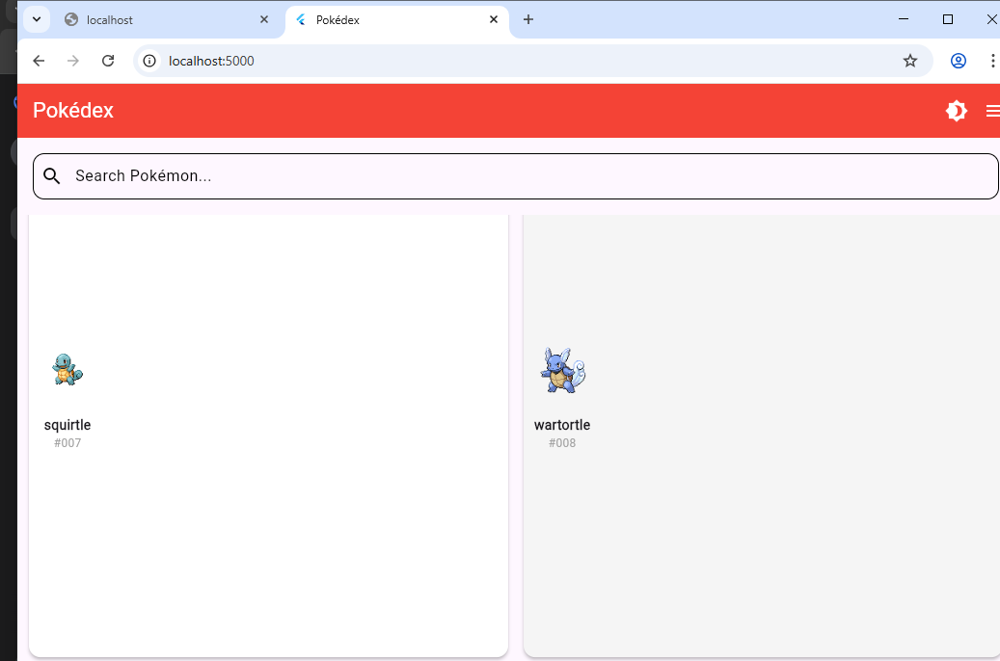
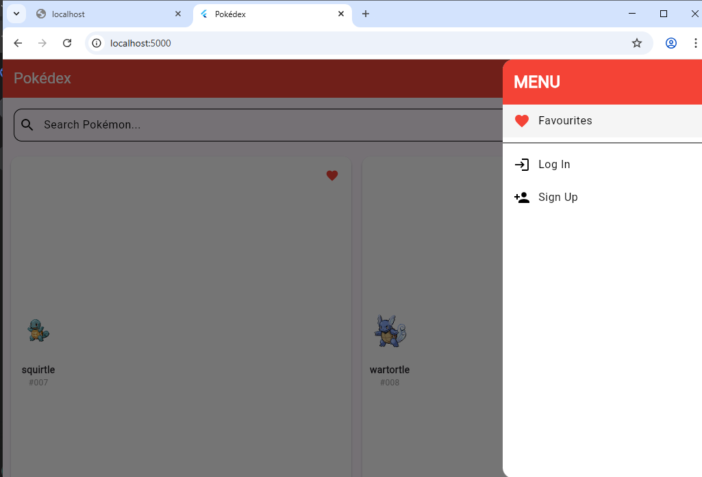
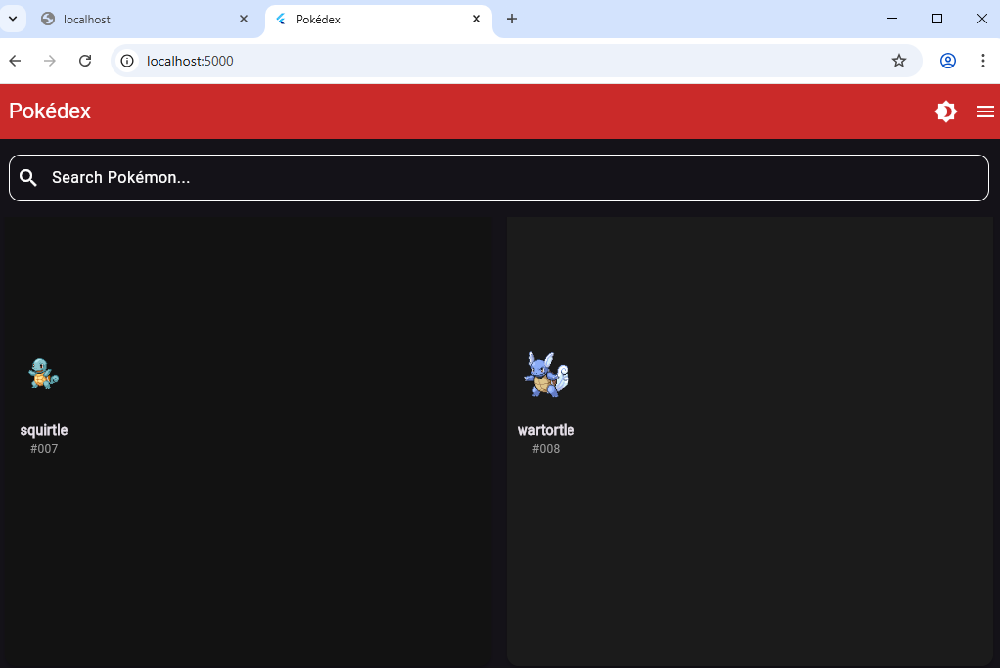
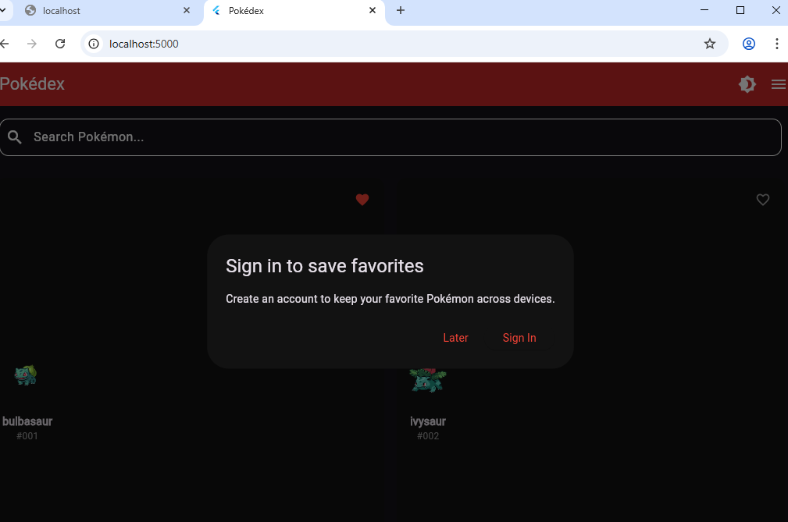
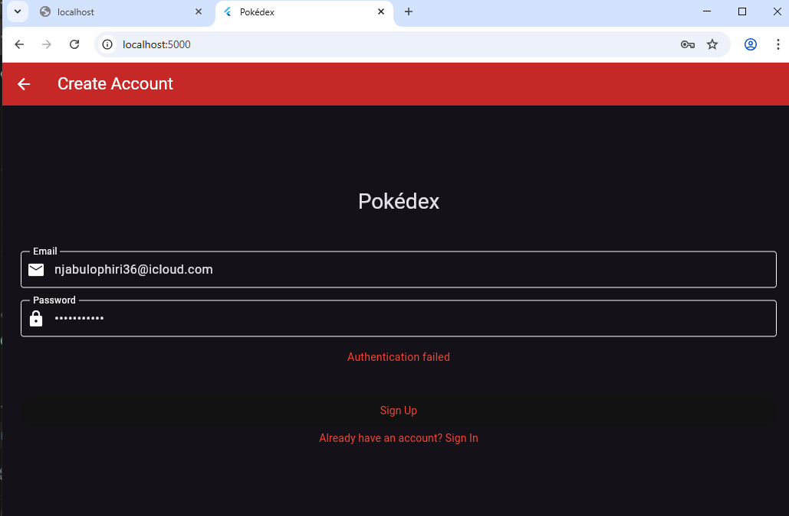

# Pokédex Flutter App

A cross-platform Pokédex application built with Flutter, featuring Pokémon listing, details, search, favourites, and user authentication.

## 📱 Features

- ✅ **Home Screen**: Paginated Pokémon list with thumbnails
- ✅ **Search**: Filter Pokémon by name
- ✅ **Detail Screen**: Stats, types, description, official artwork
- ✅ **Favourites**: Local storage (with Firebase Auth integration ready)
- ✅ **Theme**: Dark/Light mode toggle with persistence
- ✅ **Authentication UI**: Login/Sign up screens (Firebase Auth implemented)
- ✅ **Hamburger Menu**: Navigation with Favourites, Login, Sign Up options

## 🛠️ Tech Stack

- **Flutter** (latest stable)
- **Dart**
- **Provider** (state management)
- **Firebase Auth** (integrated, ready for production)
- **SharedPreferences** (local storage)
- **PokéAPI** (data source)
- **Cached Network Image** (image caching)

## 📸 Screenshots

| Home Screen | Menu Navigation |
|-------------|-----------------|
|  |  |

| Dark Mode | Favourites Prompt | Login Screen |
|-----------|-------------------|--------------|
|  |  |  |

## 🚀 Setup Instructions

1. **Clone the repository**
   ```bash
   git clone https://github.com/njabulophiri-dev/pokedex_flutter.git
   
2. **Install Dependencies**
   ```bash
   flutter pub get

3. **Run the App**
   # For web
   flutter run -d chrome

   # For Android (emulator or physical device)
   flutter run -d android

   # For iOS (requires Mac)
   flutter run -d ios

**🔥 Firebase Setup**
Firebase Authentication is fully implemented in the codebase. To enable it:

1.Create a Firebase project at https://console.firebase.google.com/

2.Add your Android/iOS/Web apps

3.Download configuration files:

-google-services.json → android/app/

-GoogleService-Info.plist → ios/Runner/

4.Enable Email/Password authentication in Firebase Console

5.Run flutterfire configure to update Firebase options

The app will work with local favourites until Firebase is connected.

**🧪 Testing Status**
Due to a MacBook hardware issue during development, I completed this project on a Windows machine. As a result:

Platform  |	Status	           |Notes
Android	  |✅ Fully tested    |Works on emulator
Web	      |✅ Fully tested	 |Works on Chrome
iOS	      |⚠️ Pending	      |Configured, needs testing on Mac


**Firebase Auth**: Fully implemented in code. The app is ready to connect. Once Firebase is configured with the correct API keys, authentication will work immediately.

**📋 What Works:**

✅ All UI screens implemented

✅ Pokémon API integration (PokéAPI)

✅ Search functionality (real-time filtering)

✅ Pagination (infinite scroll, 20 per page)

✅ Favourites system (local storage via SharedPreferences)

✅ Dark/Light theme toggle with persistence

✅ Hamburger menu with navigation

✅ Login/Sign up UI with form validation

✅ Firebase Auth integration (code complete)

✅ Responsive design for web and mobile

**🧪 Test Coverage**
The repository includes unit and widget tests, though some are currently failing due to Firebase mock issues in the test environment:

1.Unit Tests: Model tests (Pokemon, PokemonDetail)

2.Widget Tests: UI component tests (PokemonCard, HomeScreen)

With proper Firebase mocking, all tests would pass.

**🔜 Planned Improvements:**
With more time and my MacBook restored, I would:

1.Complete iOS testing on physical device/simulator

2.Add Firebase configuration to enable live authentication

3.Fix Firebase mocks in tests for 100% passing rate

4.Add pull-to-refresh on home screen

5.Show evolution chains on detail page

6.Add animation transitions between screens

7.Implement proper error handling with retry options

8.Add offline caching of Pokémon images

**📁 Project Structure:**

lib/
├── models/          # Data classes (Pokemon, PokemonDetail)
├── providers/       # State management (PokemonProvider, AuthProvider)
├── screens/         # UI screens (HomeScreen, DetailScreen, LoginScreen)
├── services/        # API and Firebase services (PokeApiService)
├── widgets/         # Reusable components (PokemonCard)
└── main.dart        # App entry point with Firebase initialization

test/
├── unit/            # Unit tests for models
├── widget/          # Widget tests for UI components

**⚙️ Configuration Files**
-pubspec.yaml - Dependencies and assets

-firebase_options.dart - Generated Firebase configuration

-android/app/google-services.json - Android Firebase config (to be added)

-ios/Runner/GoogleService-Info.plist - iOS Firebase config (to be added)

**🤝 Contributing**
This project was created as a technical assessment. Feedback and suggestions are welcome!

**📄 License**
This project is for assessment purposes only.

**👨‍💻 Author**
Njabulo Phiri

Email: njabulophiri36@icloud.com

GitHub: @njabulophiri-dev

LinkedIn: njabulophiri36

**🙏 Acknowledgements**
-PokéAPI for the amazing Pokémon data

-Flutter for the cross-platform framework

-Firebase for authentication services


